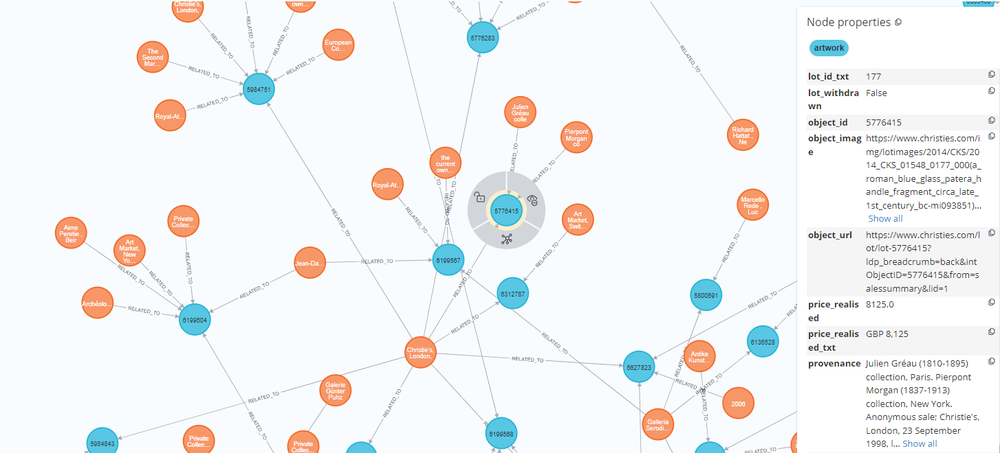

# AIKoGAM
An AI-driven Knowledge Graph of the Antiquities market: toward automatised methods to identify illicit trafficking networks
The notebook allows artworks and their provenance data collection, the building of a Knowledge Graph derived from these data, through NLP enhanced event extraction, on Neo4j and the performing of different Network Analysis on the Graph.

Part of code are partially adapted from: Hebatallah Mohamed (hebatallah.mohamed@iit.it)
Author: Riccardo Giovanelli (riccardo.giovanelli@unive.it)


## Installation:

1. Clone this repository
2.  Install Neo4J and adjust the following configurations in the 'config.py' under the 'setup' folder.
```
neo4j = {
    "uri":"bolt://localhost:7687",
    "username": "neo4j",
    "password": "admininstrator",
    "encrypted": False
}
```
3. Clone this repository from your command line
```
git clone https://github.com/riccardogvn/AIKoGAM.git
```
5. Instal Jupyter Lab from your command line (we suggest to do so after creating a new virtual environment)
```
pip install jupyter lab
```

## Execution:

1. Launch Jupyter Lab from your command line
```
jupyter lab
```
2. From Jupyter Lab open the file AIKoGAM_notebook.ipynb and follow the instruction in the notebook


## Output:

The KG will consist of nodes of type "Artwork" and "Event", as illustrated below. The following Cypher query helps showing a subset of a connected part of the KG:

```
MATCH (n:event)--()
WITH n,count(*) as rel_cnt
WHERE rel_cnt > 1
WITH n LIMIT 20
CALL apoc.path.subgraphNodes(n, {minLevel:0}) YIELD node
return node
```

"Artwork" entity example:



"Event" entity example:


